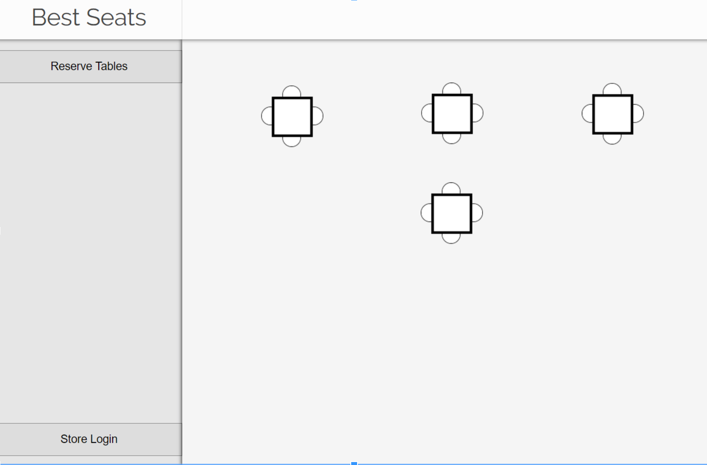

# Table Tracker

Table tracker is a server and client interface for tracking avaliable locations on a larger map. It was designed to bed used in the context of a food court, to track which tables and how many were taken, and display this information on a kiosk to a user.

This part of the software simply tracks the information and requires another program to somehow gather the information and pass it in via its API. It was originally designed for use with BLE Beacons at tables to be dtected by nearby phones that would report the location as taken.